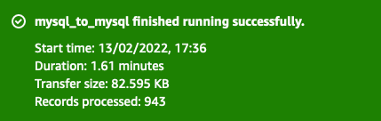
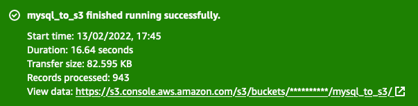

# Amazon AppFlow Custom JDBC Connector example

This project contains source code and supporting files that implements Amazon Custom Connector SDK and represents a JDBC connector example. You can deploy this the SAM CLI. It includes the following files and folders.

- src/main - Code for the application's Lambda function.
- src/test - Unit tests for the application code. 
- template.yaml - A SAM template that defines the application's AWS resources.

The application uses AWS Lambda function with concrete IAM policy following the least-privileges principle. These resources are defined in the `template.yaml` file in this project. You can update the template to add other AWS resources through the same deployment process that updates your application code.

## Important considerations and path to production
The code provided with this example is aimed to demonstrate how you can use the Amazon AppFlow Custom SDK, and is **not production ready code.** It is important to understand the additional effort necessary to build a production-ready solution from this Proof of Concept. We have produced a non-exhaustive list of gaps that we believe exist between the Proof of Concept and a production-ready solution.

The gaps are categorized into few Perspectives; one being focused purely on functional aspects of the solution and the others coming from AWS Cloud Adoption Framework (AWS CAF).

The AWS CAF helps organizations understand how cloud adoption transforms the way they work, and it provides structure to identify and address gaps in skills and processes. Looking at the solution from AWS CAF perspectives results in an actionable plan with defined work streams that can guide your organization to effectively deriving value from implementing your cloud-based solution in production. This framework leverages our experiences and best practices in assisting organizations around the world with their cloud adoption journey.

More information can be found at on [AWS CAF page](https://aws.amazon.com/professional-services/CAF/)

| Perspective (6 CAF + Functional)      | Category | Recommendation     |
| :---        |    :----:   |          ---: |
| Security | | Security |	Any API Endpoints and Lambda Function should be secured within AWS and access restricted. |
| Operations | 	Monitoring |	You should include the components deployed by the Proof of Concept in your own Monitoring tools. |
| Operations | 	Logging & Alerting |The Proof of Concept has been configured to output all logs to CloudWatch. You need to integrate this log data into your own logging system. |
| Platform | 	Automate release management |	Introduce application lifecycle and route to production by using several environments |
| Platform | 	Automate resources provisioning |	Introduce infrastructure and application configuration automation to accelerate the path to production |
| People | 	Upskilling the workforce |	People trained to support and evolve the solution on the infrastructure and application level |
| Security | 	Identity and Access Management |	Fine-grained policies and roles associated with appropriate users and groups created to reduce human access to production systems and data. |
| Security | 	Infrastructure Security |	Implement a security baseline including trust boundaries, system security configuration and maintenance (e.g., harden and patch), and other appropriate policy enforcement points |
| Security | 	Infrastructure Security |	Consider adding VPC and S3 VPC endpoint where applicable. |
| Security | 	Data Protection |	Utilize appropriate safeguards to protect data in transit and at rest. Safeguards include fine-grained access controls to objects, creating and controlling the encryption keys used to encrypt your data and key rotation strategies for the database connectivity credentials. |
| Security	Incident Response |	Review current incident response processes and determine if and how automated response and recovery will become operational and managed for AWS assets. |
| Operations | 	Tagging & Cost Optimization |	Introduce tagging to control and optimize infrastructure cost |
| Operations | 	Resiliency |	Architect your solution to deliver against HA/DR/BC requirements you have |
| Operations | 	Release and Change Management processes |	Create capability to manage, plan, and schedule changes to the solution, if needed |
| Platform | 	Path to Production |	Implement lifecycle policies for any data stored durably on destination S3 buckets, so that obsolete data is automatically removed. |
| Security | 	Data Protection |	JDBC and ODBC drivers does not encrypt your data for transmission. To provide security for the database traffic you need to tunnel the ODBC traffic through the network using Secure Shell,  Secure Sockets Layer, Point-to-Point tunneling, Protocol/Layer 2 Tunneling Protocol or IPSec. |


## Deploy the sample application

The Serverless Application Model Command Line Interface (SAM CLI) is an extension of the AWS CLI that adds functionality for building and testing Lambda applications. It uses Docker to run your functions in an Amazon Linux environment that matches Lambda. It can also emulate your application's build environment and API.

To use the SAM CLI, you need the following tools.

* AWS CLI - [Install the AWS CLI](https://docs.aws.amazon.com/cli/latest/userguide/getting-started-install.html)
* SAM CLI - [Install the SAM CLI](https://docs.aws.amazon.com/serverless-application-model/latest/developerguide/serverless-sam-cli-install.html)
* Java11 - [Install the Java 11](https://docs.aws.amazon.com/corretto/latest/corretto-11-ug/downloads-list.html)
* Maven - [Install Maven](https://maven.apache.org/install.html)

To build and deploy your application for the first time, run the following in your shell:

```bash
mvn package
sam deploy --guided
```

The first command will build the source of your application. The second command will package and deploy your application to AWS, with a series of prompts:

* **Stack Name**: The name of the stack to deploy to CloudFormation. This should be unique to your account and region, and a good starting point would be something matching your project name.
* **AWS Region**: The AWS region you want to deploy your app to.
* **Confirm changes before deploy**: If set to yes, any change sets will be shown to you before execution for manual review. If set to no, the AWS SAM CLI will automatically deploy application changes.
* **Allow SAM CLI IAM role creation**: Many AWS SAM templates, including this example, create AWS IAM roles required for the AWS Lambda function(s) included to access AWS services. By default, these are scoped down to minimum required permissions. To deploy an AWS CloudFormation stack which creates or modifies IAM roles, the `CAPABILITY_IAM` value for `capabilities` must be provided. If permission isn't provided through this prompt, to deploy this example you must explicitly pass `--capabilities CAPABILITY_IAM` to the `sam deploy` command.
* **Save arguments to samconfig.toml**: If set to yes, your choices will be saved to a configuration file inside the project, so that in the future you can just re-run `sam deploy` without parameters to deploy changes to your application.

## Add a resource to your application
The application template uses AWS Serverless Application Model (AWS SAM) to define application resources. AWS SAM is an extension of AWS CloudFormation with a simpler syntax for configuring common serverless application resources such as functions, triggers, and APIs. For resources not included in [the SAM specification](https://github.com/awslabs/serverless-application-model/blob/master/versions/2016-10-31.md), you can use standard [AWS CloudFormation](https://docs.aws.amazon.com/AWSCloudFormation/latest/UserGuide/aws-template-resource-type-ref.html) resource types.

## Fetch, tail, and filter Lambda function logs

To simplify troubleshooting, SAM CLI has a command called `sam logs`. `sam logs` lets you fetch logs generated by your deployed Lambda function from the command line. In addition to printing the logs on the terminal, this command has several nifty features to help you quickly find the bug.

`NOTE`: This command works for all AWS Lambda functions; not just the ones you deploy using SAM.

```bash
sam logs -n ConnectorFunction --stack-name <stack-name-provided-during-sam-deploy> --tail
```

You can find more information and examples about filtering Lambda function logs in the [SAM CLI Documentation](https://docs.aws.amazon.com/serverless-application-model/latest/developerguide/serverless-sam-cli-logging.html).

## Result
Integrating MySQL source to a MySQL destination would yield results like:



Also, with this custom JDBC connector you can ship records from MySQL to S3 and the results would look like:



## Cleanup

To delete the sample application that you created, use the AWS CLI. Assuming you used your project name for the stack name, you can run the following:

```bash
sam delete
```

## Resources

See the [AWS SAM developer guide](https://docs.aws.amazon.com/serverless-application-model/latest/developerguide/what-is-sam.html) for an introduction to SAM specification, the SAM CLI, and serverless application concepts.

Next, you can use AWS Serverless Application Repository to deploy ready to use Apps that go beyond hello world samples and learn how authors developed their applications: [AWS Serverless Application Repository main page](https://aws.amazon.com/serverless/serverlessrepo/)
